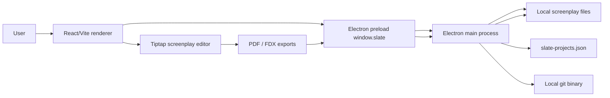
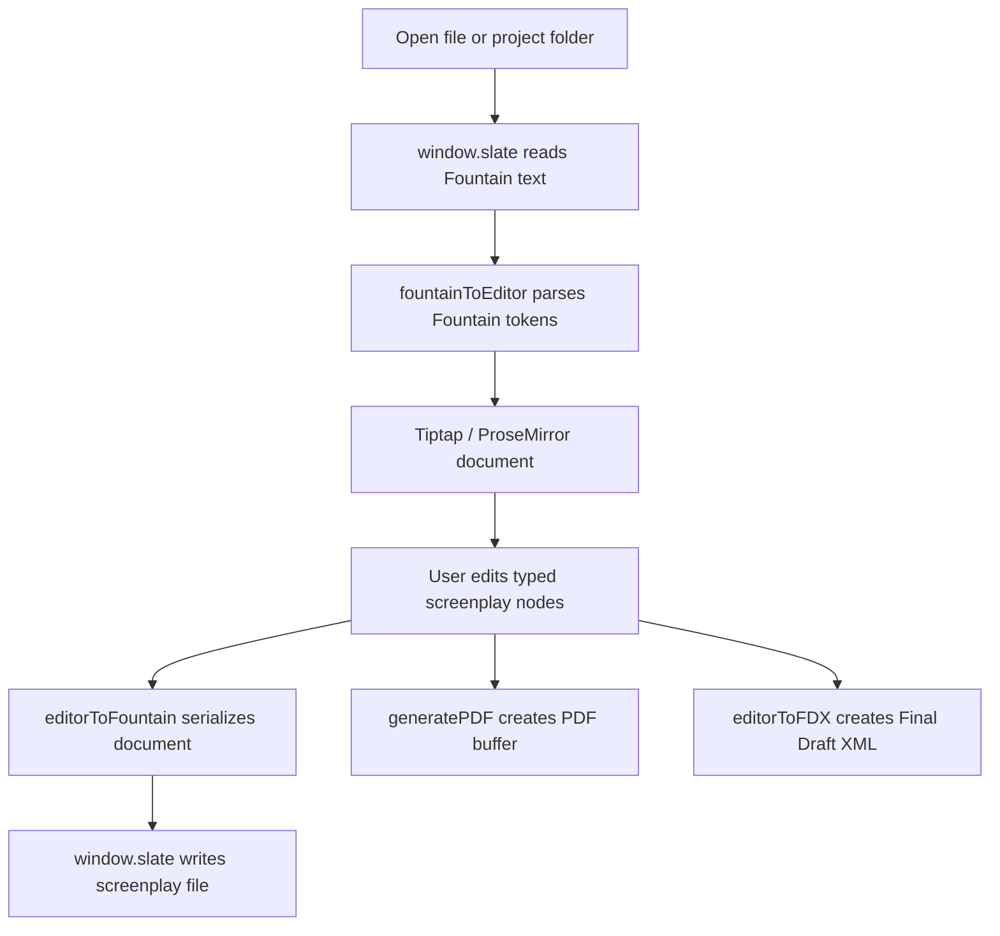

# Architecture

Slate is a medium-complexity single desktop application. It has one React/Vite renderer and one Electron native shell. There is no backend server, database, authentication service, hosted API, or monorepo package boundary in the current repository.

The main architectural responsibility split is:

- The renderer owns product behavior: screenplay editing, routing, panels, file workflow orchestration, Fountain parsing, pagination, exports, analytics, and UI state.
- The Electron main process owns native capabilities: desktop windowing, file dialogs, filesystem access, file watching, local project metadata persistence, Git execution, IPC handlers, and bundle configuration.
- The preload script exposes a narrow typed `window.slate` API. The renderer does not receive Node.js APIs.

## Runtime Overview

## Application Flow

The router is defined in `src/router.tsx` with TanStack Router hash history.

- `/` renders `WelcomeRoute`.
- `/editor` renders `EditorRoute`.
- Unknown routes navigate back to `/`.

`WelcomeRoute` lets the user open a project folder through `window.slate.openDirectoryDialog`. It stores the selected project in `useProjectStore`, writes an editor-session snapshot, and navigates to `/editor`.

`EditorRoute` restores the last session from `sessionStorage`, opens the last screenplay file when possible, falls back to `untitled.fountain` or another `.fountain`/`.spmd` file in the project folder, and then mounts the editor workspace.

## Electron Layers

### Main Process

`electron/main/index.ts` creates the `BrowserWindow`, installs security defaults, and registers IPC handlers.

Current handler groups:

- native open/save dialogs
- text and binary file reads/writes
- directory reads
- file stat and file watching
- recent project metadata read/write
- Git status, root, log, diff, commit, and checkout-file operations

Git is executed with `execFile("git", args, { cwd })`; no generic shell execution is exposed.

### Preload

`electron/preload/index.ts` exposes `window.slate` through `contextBridge`.
The preload is bundled as CommonJS to `out/preload/index.cjs` because Slate runs
the renderer with Electron sandboxing enabled.

The public contract lives in:

- `electron/shared/types.ts`
- `electron/shared/ipc.ts`
- `src/slate-env.d.ts`

Renderer code should call `src/lib/fileService.ts`, `src/lib/git/commands.ts`, or `useProjectStore` instead of invoking IPC directly.

### Renderer

The renderer entrypoint is still `src/main.tsx`. It is bundled by the renderer section of `electron.vite.config.ts` and can also be served alone through `vite.config.ts` for renderer-only work.

`index.html` includes `translate="no"`, `class="notranslate"`, and the Google `notranslate` meta tag so browser translation tools do not mutate the React DOM.

## Renderer Layers

### Routes

`src/routes/WelcomeRoute.tsx` and `src/routes/EditorRoute.tsx` are the main product coordinators. They connect hooks, services, editor refs, navigation, exports, stats, file explorer state, Git state, and side panels.

### Components

`src/components/` contains the visible product surfaces:

- `Editor.tsx` mounts the Tiptap editor.
- `Toolbar.tsx` exposes document, export, title-page, stats, file explorer, screenplay element, scene-numbering, revision, and project-close actions.
- `FileExplorer.tsx` displays the opened project folder.
- `GitHistory.tsx` displays Git information when the folder is a Git repository.
- `StatsSidePanel.tsx` and `src/components/stats/*` display the full statistics page and analysis tabs.
- `ScreenplayPageStack.tsx` and `TitlePageView.tsx` frame screenplay output and title-page data.

`src/components/ui/` contains shadcn-style UI primitives and local component wrappers.

### Tiptap Screenplay Model

`src/extensions/index.ts` exports the active editor extension list. It combines built-in Tiptap extensions with custom screenplay nodes and plugins:

- `ScreenplayDocument`
- `SceneHeading`
- `Action`
- `Character`
- `Dialogue`
- `Parenthetical`
- `Transition`
- `DualDialogue`
- `DualDialogueColumn`
- `PageBreak`
- `Section`
- `Synopsis`
- `Note`
- `ScreenplayKeymap`
- `ScreenplayAutocomplete`
- `PageNumbers`
- `RevisionMark`

This design keeps screenplay structure typed inside ProseMirror instead of relying on plain text heuristics throughout the app.

### Hooks And Services

Important renderer state is organized through hooks and services:

- `src/hooks/useDocument.ts` manages the active document, dirty state, title page, autosave, reloads, file open/save, and external-change behavior.
- `src/hooks/useFileWatcher.ts` subscribes to main-process file watch events for the active file.
- `src/hooks/useFileExplorer.ts` reads local folders and filters noisy directories.
- `src/hooks/useProjectStore.ts` persists recent projects through `window.slate.projects`.
- `src/hooks/useGit.ts` reads Git status and history through `src/lib/git/commands.ts`.
- `src/lib/fileService.ts` wraps `window.slate` file, dialog, directory, watch, and export-write operations.
- `src/lib/editorSession.ts` stores route restoration state in `sessionStorage`.

## Data And Persistence

Slate does not use a database. Current persistence is:

| Data | Storage |
| --- | --- |
| Screenplay contents | Local user-selected files through Electron IPC |
| Recent projects | `slate-projects.json` under Electron `userData` |
| Current editor session | Browser `sessionStorage` key `slate-editor-session` |
| Git state | Read on demand from the local `git` binary |
| Exported PDF/FDX files | User-selected paths through Electron save dialogs |

## Screenplay Data Flow

## Export Architecture

Slate has two current export paths:

- `src/lib/export/pdf.ts` builds a `pdfmake` document definition, registers embedded Courier Prime fonts from `src/lib/export/pdfFonts.ts`, and produces a `Uint8Array` PDF buffer.
- `src/lib/export/fdx.ts` generates Final Draft XML directly from the ProseMirror document and optional title-page data.

Both export paths are invoked from `EditorRoute` and written to disk through `src/lib/fileService.ts`.

## Current Boundaries And Limitations

- No backend process or API server exists.
- No database, ORM, migration, seed, or persistent schema exists.
- No authentication or authorization model exists.
- No CI/CD or hosted deployment configuration is committed.
- No signing, notarization, release channel, or auto-update policy is configured.
- The Electron IPC bridge should be reviewed and narrowed before broader distribution.
