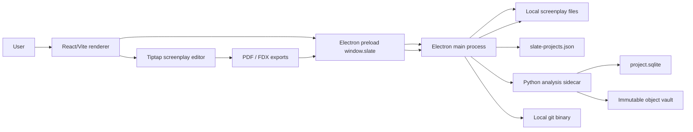
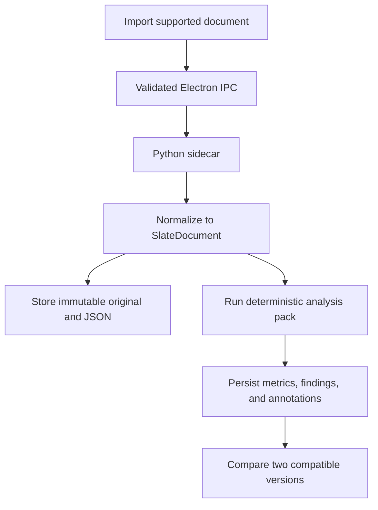
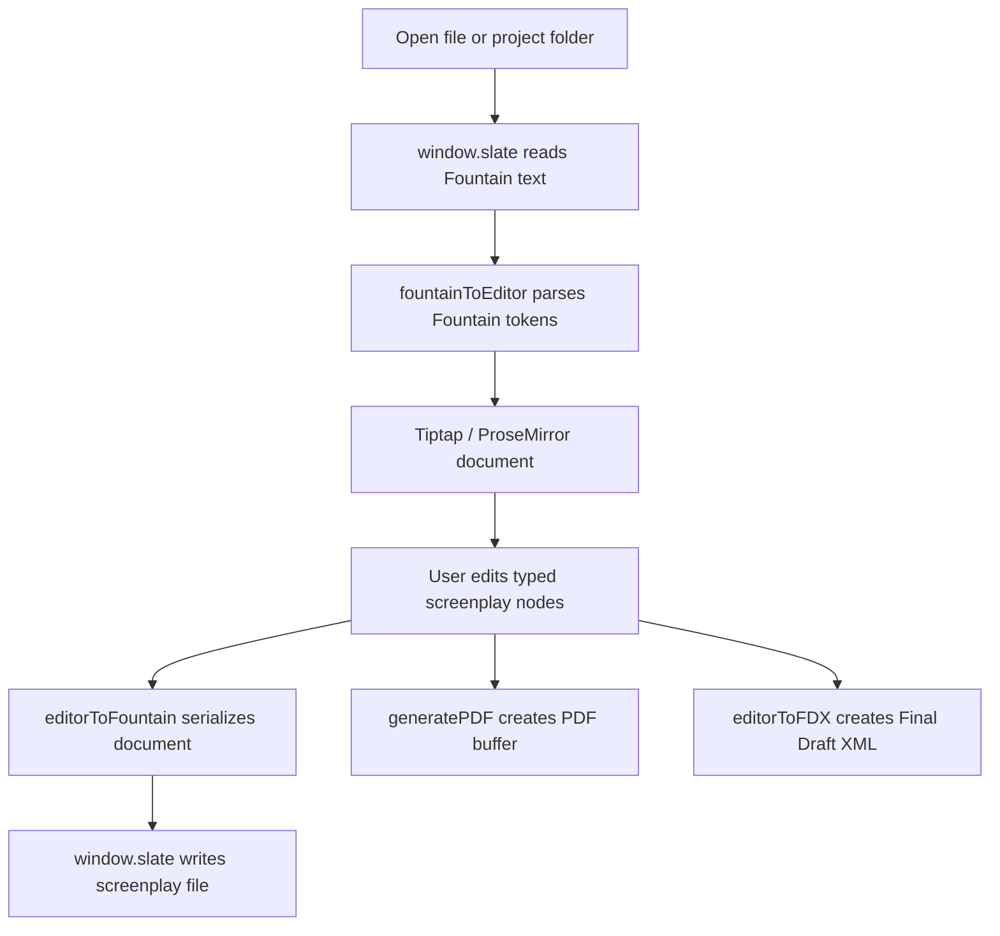

# Architecture

Slate is a local-first desktop application with a React/Vite renderer, an Electron native shell, and a Python document-analysis sidecar. The primary product workflow uses a portable SQLite project database. The previous screenplay editor remains as an internal legacy route during migration.

The main architectural responsibility split is:

- The renderer owns product behavior: project navigation, version timelines, analysis views, normalized/PDF document presentation, comparison, and UI state. It also retains the legacy screenplay editor modules.
- The Electron main process owns native capabilities: desktop windowing, file dialogs, sidecar lifecycle, filesystem access, file watching, local recent-project metadata, Git execution for the legacy route, IPC handlers, and bundle configuration.
- The preload script exposes a narrow typed `window.slate` API. The renderer does not receive Node.js APIs.
- The Python sidecar owns project persistence, immutable imports, normalization, deterministic analysis, annotations, and comparisons.

## Runtime Overview



## Application Flow

The router is defined in `src/router.tsx` with TanStack Router hash history.

- `/` renders `WelcomeRoute`.
- `/project` renders the primary `ProjectRoute` analysis workspace.
- `/editor` renders `EditorRoute`.
- Unknown routes navigate back to `/`.

`WelcomeRoute` creates or opens a portable Slate project through the typed intelligence API, stores its path in the recent-project list, writes an intelligence-session snapshot, and navigates to `/project`.

`ProjectRoute` loads the immutable version timeline and coordinates `Overview`, `Document`, and `Compare`. It imports supported files through a native dialog and receives progress notifications without direct filesystem or subprocess access.

`EditorRoute` is retained as a legacy internal route. It restores the previous editor session and mounts the screenplay workspace, but it is no longer linked from the primary product surface.

## Electron Layers

### Main Process

`electron/main/index.ts` creates the `BrowserWindow`, installs security defaults, and registers IPC handlers.

Current handler groups:

- native open/save dialogs
- text and binary file reads/writes
- directory reads
- file stat and file watching
- recent project metadata read/write
- Git status, root, log, diff, commit, and checkout-file operations
- project creation/opening, immutable version import, normalized document retrieval,
  deterministic analysis, comparison, progress, and cancellation

Git is executed with `execFile("git", args, { cwd })`; no generic shell execution is exposed.

The document engine is started through `EngineClient`. Development uses `uv run`
against `engine/`; packaged applications use the platform-specific PyInstaller
binary under Electron resources. JSON-RPC messages travel over `stdin/stdout`, so
the application opens no local HTTP port.

### Preload

`electron/preload/index.ts` exposes `window.slate` through `contextBridge`.
The preload is bundled as CommonJS to `out/preload/index.cjs` because Slate runs
the renderer with Electron sandboxing enabled.

The public contract lives in:

- `electron/shared/types.ts`
- `electron/shared/ipc.ts`
- `src/slate-env.d.ts`

Renderer code should call `src/lib/fileService.ts`, `src/lib/git/commands.ts`, or `useProjectStore` instead of invoking IPC directly.

### Renderer

The renderer entrypoint is still `src/main.tsx`. It is bundled by the renderer section of `electron.vite.config.ts` and can also be served alone through `vite.config.ts` for renderer-only work.

`index.html` includes `translate="no"`, `class="notranslate"`, and the Google `notranslate` meta tag so browser translation tools do not mutate the React DOM.

## Renderer Layers

### Routes

`src/routes/WelcomeRoute.tsx` and `src/routes/ProjectRoute.tsx` are the primary product coordinators. `EditorRoute.tsx` remains isolated as the legacy screenplay workspace.

### Components

`src/components/` contains the visible product surfaces:

- `IntelligenceWelcome.tsx` provides the project list and project creation flow.
- `src/components/intelligence/*` provides metrics, normalized/PDF reading,
  annotations, and pairwise comparison.
- `Editor.tsx` mounts the Tiptap editor.
- `Toolbar.tsx` exposes document, export, title-page, stats, file explorer, screenplay element, scene-numbering, revision, and project-close actions.
- `FileExplorer.tsx` displays the opened project folder.
- `GitHistory.tsx` displays Git information when the folder is a Git repository.
- `StatsSidePanel.tsx` and `src/components/stats/*` display the full statistics page and analysis tabs.
- `ScreenplayPageStack.tsx` and `TitlePageView.tsx` frame screenplay output and title-page data.

`src/components/ui/` contains shadcn-style UI primitives and local component wrappers.

### Tiptap Screenplay Model

`src/extensions/index.ts` exports the active editor extension list. It combines built-in Tiptap extensions with custom screenplay nodes and plugins:

- `ScreenplayDocument`
- `SceneHeading`
- `Action`
- `Character`
- `Dialogue`
- `Parenthetical`
- `Transition`
- `DualDialogue`
- `DualDialogueColumn`
- `PageBreak`
- `Section`
- `Synopsis`
- `Note`
- `ScreenplayKeymap`
- `ScreenplayAutocomplete`
- `PageNumbers`
- `RevisionMark`

This design keeps screenplay structure typed inside ProseMirror instead of relying on plain text heuristics throughout the app.

### Hooks And Services

Important renderer state is organized through hooks and services:

- `src/hooks/useDocument.ts` manages the active document, dirty state, title page, autosave, reloads, file open/save, and external-change behavior.
- `src/hooks/useFileWatcher.ts` subscribes to main-process file watch events for the active file.
- `src/hooks/useFileExplorer.ts` reads local folders and filters noisy directories.
- `src/hooks/useProjectStore.ts` persists recent projects through `window.slate.projects`.
- `src/hooks/useGit.ts` reads Git status and history through `src/lib/git/commands.ts`.
- `src/lib/fileService.ts` wraps `window.slate` file, dialog, directory, watch, and export-write operations.
- `src/lib/editorSession.ts` stores route restoration state in `sessionStorage`.

## Data And Persistence

Primary document projects use the following portable layout:

```text
SlateProject/
|-- project.sqlite
|-- objects/<content-hash>.<extension>
|-- normalized/<version-id>.json
`-- artifacts/
```

SQLAlchemy defines the local schema and Alembic applies migrations when a project
is created or opened. Original sources and normalized versions are immutable.

Current persistence is:

| Data | Storage |
| --- | --- |
| Screenplay contents | Local user-selected files through Electron IPC |
| Recent projects | `slate-projects.json` under Electron `userData` |
| Document project metadata and results | Portable `project.sqlite` |
| Immutable imported sources | Portable `objects/` content-addressed vault |
| Normalized document contracts | Portable `normalized/` JSON files |
| Current editor session | Browser `sessionStorage` key `slate-editor-session` |
| Git state | Read on demand from the local `git` binary |
| Exported PDF/FDX files | User-selected paths through Electron save dialogs |

## Document Intelligence Data Flow



## Screenplay Data Flow



## Export Architecture

Slate has two current export paths:

- `src/lib/export/pdf.ts` builds a `pdfmake` document definition, registers embedded Courier Prime fonts from `src/lib/export/pdfFonts.ts`, and produces a `Uint8Array` PDF buffer.
- `src/lib/export/fdx.ts` generates Final Draft XML directly from the ProseMirror document and optional title-page data.

Both export paths are invoked from `EditorRoute` and written to disk through `src/lib/fileService.ts`.

## Current Boundaries And Limitations

- The Python process is local and child-owned; no HTTP API or local port exists.
- The SQLite schema is per project and supports one logical document timeline.
- No authentication or authorization model exists.
- OCR, AI providers, collaboration, and hosted sync are not implemented.
- No CI/CD or hosted deployment configuration is committed.
- No signing, notarization, release channel, or auto-update policy is configured.
- The Electron IPC bridge should be reviewed and narrowed before broader distribution.
