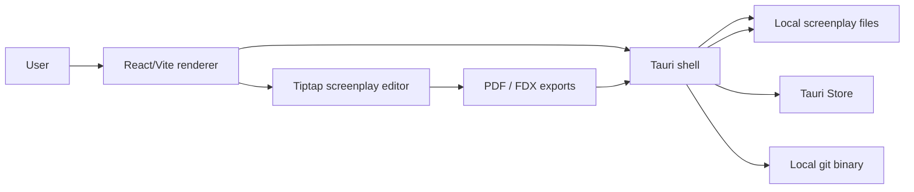
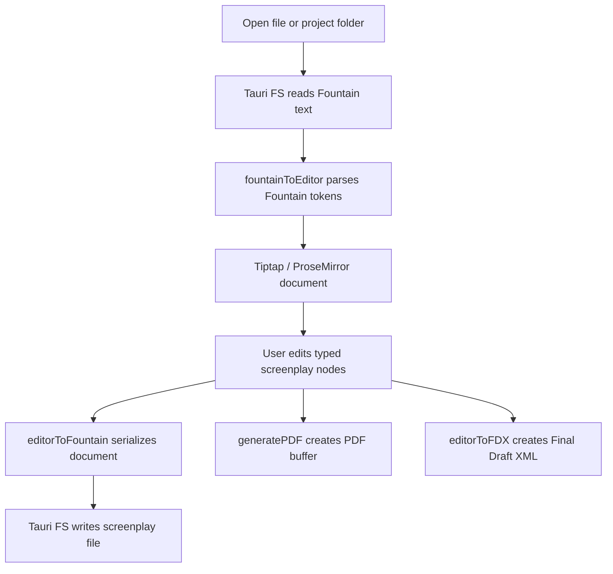

# Architecture

Slate is a medium-complexity single desktop application. It has one React/Vite renderer and one Tauri 2 native shell. There is no backend server, database, authentication service, hosted API, or monorepo package boundary in the current repository.

The main architectural responsibility split is:

- The renderer owns product behavior: screenplay editing, routing, panels, file workflow orchestration, Fountain parsing, pagination, exports, analytics, and UI state.
- The Tauri shell owns native capabilities: desktop windowing, file-system permissions, native dialogs, local store persistence, shell access for Git, and bundle configuration.

## Runtime Overview

## Application Flow

The router is defined in `src/router.tsx` with TanStack Router hash history.

- `/` renders `WelcomeRoute`.
- `/editor` renders `EditorRoute`.
- Unknown routes navigate back to `/`.

`WelcomeRoute` lets the user open a project folder through the Tauri dialog plugin. It stores the selected project in `useProjectStore`, writes an editor-session snapshot, and navigates to `/editor`.

`EditorRoute` restores the last session from `sessionStorage`, opens the last screenplay file when possible, falls back to `untitled.fountain` or another `.fountain`/`.spmd` file in the project folder, and then mounts the editor workspace.

## Renderer Layers

### Routes

`src/routes/WelcomeRoute.tsx` and `src/routes/EditorRoute.tsx` are the main product coordinators. They connect hooks, services, editor refs, navigation, exports, stats, file explorer state, Git state, and side panels.

### Components

`src/components/` contains the visible product surfaces:

- `Editor.tsx` mounts the Tiptap editor.
- `Toolbar.tsx` exposes document, export, title-page, stats, AI, file explorer, scene-numbering, revision, and project-close actions.
- `FileExplorer.tsx` displays the opened project folder.
- `GitHistory.tsx` displays Git information when the folder is a Git repository.
- `StatsSidePanel.tsx` and `src/components/stats/*` display analysis tabs.
- `AISidePanel.tsx` provides copyable prompt suggestions and disk-change guidance.
- `ScreenplayPageStack.tsx` and `TitlePageView.tsx` frame screenplay output and title-page data.

`src/components/ui/` contains shadcn-style UI primitives and local component wrappers.

### Tiptap Screenplay Model

`src/extensions/index.ts` exports the active editor extension list. It combines built-in Tiptap extensions with custom screenplay nodes and plugins:

- `ScreenplayDocument`
- `SceneHeading`
- `Action`
- `Character`
- `Dialogue`
- `Parenthetical`
- `Transition`
- `DualDialogue`
- `DualDialogueColumn`
- `PageBreak`
- `Section`
- `Synopsis`
- `Note`
- `ScreenplayKeymap`
- `ScreenplayAutocomplete`
- `PageNumbers`
- `AIDiff`
- `RevisionMark`

This design keeps screenplay structure typed inside ProseMirror instead of relying on plain text heuristics throughout the app.

### Hooks And Services

Important renderer state is organized through hooks and services:

- `src/hooks/useDocument.ts` manages the active document, dirty state, title page, autosave, reloads, file open/save, and external-change behavior.
- `src/hooks/useFileWatcher.ts` polls the active file with Tauri FS `stat`.
- `src/hooks/useFileExplorer.ts` reads local folders and filters noisy directories.
- `src/hooks/useProjectStore.ts` persists recent projects with Tauri Store.
- `src/hooks/useGit.ts` reads Git status and history through `src/lib/git/commands.ts`.
- `src/lib/fileService.ts` wraps Tauri dialog and FS calls for document and export operations.
- `src/lib/editorSession.ts` stores route restoration state in `sessionStorage`.

## Native Shell

The native shell is intentionally small. `src-tauri/src/lib.rs` initializes:

- `tauri-plugin-fs`
- `tauri-plugin-dialog`
- `tauri-plugin-shell`
- `tauri-plugin-store`
- `tauri-plugin-log` in debug builds

`src-tauri/src/main.rs` only starts the Tauri app and suppresses the extra Windows console in release builds.

The shell currently does not implement custom Rust commands, background workers, database access, authentication, cloud sync, or AI execution. Product behavior is in the TypeScript renderer.

## Permissions

`src-tauri/capabilities/default.json` is the most important native security file. It currently grants:

- Default core permissions.
- Tauri FS read, write, read-dir, and stat permissions under `$HOME/**`.
- Dialog permissions.
- Store permissions.
- Shell permissions.
- Permission to spawn the local `git` command with unrestricted arguments.

These permissions match the current local-first editor and Git-history workflow, but they are broad and should be reviewed before distributing packaged builds.

## Data And Persistence

Slate does not use a database. Current persistence is:

| Data | Storage |
| --- | --- |
| Screenplay contents | Local user-selected files through Tauri FS |
| Recent projects | Tauri Store file `slate-projects.json` |
| Current editor session | Browser `sessionStorage` key `slate-editor-session` |
| Git state | Read on demand from the local `git` binary |
| Exported PDF/FDX files | User-selected paths through Tauri save dialogs |

## Screenplay Data Flow

## Analysis Flow

Stats and analytics are calculated locally from the current ProseMirror document:

- `src/lib/stats.ts` counts pages, scenes, words, dialogue/action ratio, and unique characters.
- `src/lib/analytics/characters.ts` analyzes character line counts, dialogue words, scene appearances, and co-occurrence.
- `src/lib/analytics/pacing.ts` maps dialogue/action density by page.
- `src/lib/analytics/readability.ts` computes dialogue readability using `syllable`.
- `src/lib/analytics/beatsheet.ts` maps Save the Cat style beat targets to page counts.
- `src/lib/analytics/bechdel.ts` evaluates Bechdel criteria when supplied with user-provided character gender labels.

There is no remote analytics service.

## Export Architecture

Slate has two current export paths:

- `src/lib/export/pdf.ts` builds a `pdfmake` document definition, registers embedded Courier Prime fonts from `src/lib/export/pdfFonts.ts`, and produces a `Uint8Array` PDF buffer.
- `src/lib/export/fdx.ts` generates Final Draft XML directly from the ProseMirror document and optional title-page data.

Both export paths are invoked from `EditorRoute` and written to disk through `src/lib/fileService.ts`.

## Current Boundaries And Limitations

- No backend process or API server exists.
- No database, ORM, migration, seed, or persistent schema exists.
- No authentication or authorization model exists.
- No external AI service is called by the app.
- No CI/CD or hosted deployment configuration is committed.
- No signing, notarization, release channel, or auto-update policy is configured.
- Tauri `csp` is currently set to `null` in `src-tauri/tauri.conf.json`.
- The broad `$HOME/**` filesystem permission and unrestricted Git arguments are practical for the prototype but should be narrowed before broader distribution.
