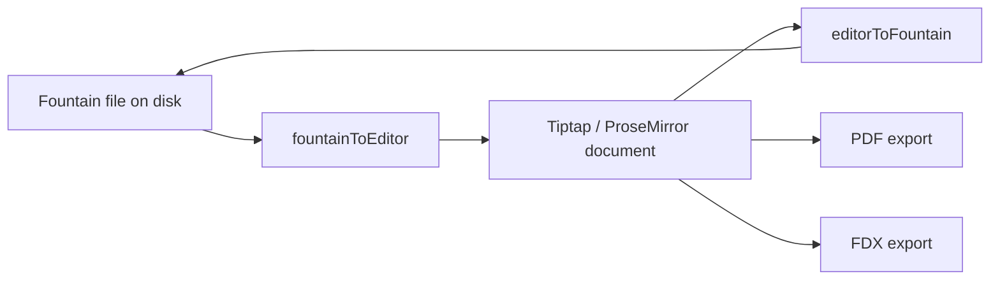

# File Formats

Slate works with several document representations. The most important contracts are Fountain text on disk, Tiptap/ProseMirror JSON in the editor, PDF export, and Final Draft XML export.

## Format Map



## Fountain Files

Slate opens and saves local screenplay files through `src/lib/fileService.ts`. The current file dialog filters support:

- `.fountain`
- `.spmd`
- `.txt`

Fountain parsing and serialization live in:

- `src/lib/fountain/deserialize.ts`
- `src/lib/fountain/serialize.ts`
- `src/lib/fountain/types.ts`
- `src/lib/fountain/helpers.ts`

The active document hook, `src/hooks/useDocument.ts`, uses these modules to convert between local text files and the editor document.

## Title Page Fields

Title-page data is represented separately from editor content as `TitlePage` in `src/lib/fountain/types.ts`.

Supported known fields include:

| Slate key | Fountain label |
| --- | --- |
| `title` | `Title` |
| `credit` | `Credit` |
| `author` | `Author` |
| `source` | `Source` |
| `draftDate` | `Draft date` |
| `contact` | `Contact` |
| `copyright` | `Copyright` |

Custom title-page fields are also allowed by the `TitlePage` index signature and are serialized after the known fields.

Example:

```fountain
Title: Night Shift
Credit: Written by
Author: Alex Writer
Draft date: 2026-05-03
Contact: alex@example.com

INT. OFFICE - NIGHT

The last monitor flickers.
```

## Tiptap Document Nodes

The active screenplay schema is registered in `src/extensions/index.ts`.

Current screenplay node types include:

| Node | Responsibility |
| --- | --- |
| `sceneHeading` | Slugline with parsed `intExt`, `location`, `timeOfDay`, optional scene number, and forced marker. |
| `action` | Action paragraph, including optional centered action. |
| `character` | Character cue with optional extension and forced marker. |
| `dialogue` | Dialogue text with supported inline marks. |
| `parenthetical` | Parenthetical dialogue direction. |
| `transition` | Transition line with optional forced marker. |
| `dualDialogue` | Two-column simultaneous dialogue container. |
| `dualDialogueColumn` | Column inside a dual-dialogue block. |
| `pageBreak` | Explicit page break. |
| `section` | Outline section. |
| `synopsis` | Synopsis text. |
| `note` | Author note. |

The editor also registers behavior extensions such as `ScreenplayKeymap`, `ScreenplayAutocomplete`, `PageNumbers`, and `RevisionMark`.

## Fountain Import Behavior

`fountainToEditor` parses Fountain text with `fountain-js`, then maps recognized tokens to Tiptap JSON.

Important current behavior:

- Title-page tokens are extracted into the separate `titlePage` object.
- Forced scene headings are detected from source lines beginning with `.`.
- Forced character cues are detected from source lines beginning with `@`.
- Forced transitions are detected from source lines beginning with `>` when they are not centered text.
- Scene headings are parsed through `parseSlugline`.
- Character extensions are parsed through `parseExtension`.
- Inline bold, italic, bold-italic, and underline are parsed for dialogue and action where supported.
- Centered text is represented as an `action` node with `centered: true`.
- `section`, `synopsis`, `note`, `pageBreak`, and dual dialogue tokens are represented in the editor document.

If the parsed document has no nodes, Slate creates a minimal document with one fallback node.

## Fountain Export Behavior

`editorToFountain` walks the ProseMirror document and serializes supported nodes back to Fountain text.

Current mappings:

| Editor node | Fountain output |
| --- | --- |
| `sceneHeading` | Uppercase scene heading, or `.` prefix when forced. |
| `action` | Action text, or `> text <` when centered. |
| `character` | Uppercase character cue, optional extension, `@` prefix when forced. |
| `dialogue` | Dialogue text with supported inline marks. |
| `parenthetical` | Text wrapped in parentheses when needed. |
| `transition` | Uppercase transition, or `>` prefix when forced. |
| `dualDialogue` | First column as normal dialogue, second character cue with `^`. |
| `pageBreak` | `===`. |
| `section` | `#` repeated by section level. |
| `synopsis` | `= text`. |
| `note` | `[[text]]`. |

The serializer trims leading blank lines, collapses excessive blank lines, and returns a single trailing newline.

## Inline Formatting

Slate currently supports these inline Fountain marks:

| Style | Fountain |
| --- | --- |
| Bold italic | `***text***` |
| Bold | `**text**` |
| Italic | `*text*` |
| Underline | `_text_` |

Inline formatting is not equally meaningful on every screenplay node. Preserve existing behavior unless a feature explicitly expands mark support.

## PDF Export

PDF export lives in `src/lib/export/pdf.ts`.

It uses:

- `pdfmake` for document generation.
- `src/lib/export/pdfStyles.ts` for page and element layout constants.
- `src/lib/export/pdfFonts.ts` for embedded Courier Prime virtual file-system data.

The PDF document uses:

- US Letter page size.
- Courier Prime font.
- 12pt screenplay text.
- WGA-like margins from `pdfStyles.ts`.
- Optional title page.
- Page numbers starting after the first script page.

Current printable mappings include scene headings, action, character cues, dialogue, parentheticals, transitions, dual dialogue, and explicit page breaks. Sections, synopses, and notes are treated as non-printable.

## Final Draft XML Export

FDX export lives in `src/lib/export/fdx.ts`.

It generates XML with:

```xml
<FinalDraft DocumentType="Script" Template="No" Version="5">
```

Current mappings include:

- `Scene Heading`
- `Action`
- `Character`
- `Dialogue`
- `Parenthetical`
- `Transition`
- Dual dialogue attributes on character paragraphs.
- Optional title-page content.

Special XML characters are escaped before writing.

## Pagination Metadata

Pagination is not stored in Fountain files. It is calculated from the editor document.

`src/lib/pagination.ts` returns:

- `pageBreaks`
- `totalPages`

Each page break can include:

- `afterPos`
- `pageNumber`
- `contdCharacter`
- `more`

This metadata is used by editor display and statistics. Export behavior should be checked separately when changing pagination rules.

## Compatibility Notes

- `.spmd` is treated as a screenplay file extension by open/default-file logic, but the current parser path still reads text and uses Fountain conversion.
- `public/manifest.json` only carries passive Slate app metadata and is unrelated to screenplay file-format support.
- The primary intelligence workflow persists metadata in `project.sqlite` and normalized content using `schemas/slate-document.schema.json`; no remote document format exists.
